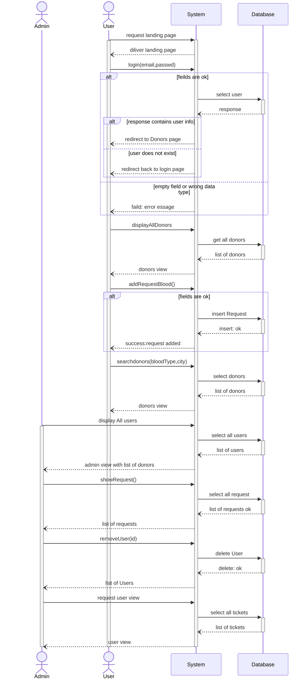

```mermaid

sequenceDiagram

actor       A as Admin
actor       U as User
participant S as System
participant D as Database

%% User: 
U ->>+S: request landing page
activate U
S --) U: diliver landing page
U ->> S: login(email,passwd)

Alt feilds are ok

    S ->>+D: select user
    D --)-S: response

    alt response contains user info
        S --) U: redirect to Donors page
    else user does not exist
        S --) U: redirect back to login page
    end
else empty field or wrong data type 
    S --) U: faild: error essage
end

U ->> S: displayAllDonors
S ->>+D: get all donors
D --)-S: list of donors
S --) U: donors view


U ->> S: addRequestBlood()

alt fields are ok
    S ->>+D: insert Request
    D --)-S: insert: ok
    S --) U: success:request added
end
%% else empty field or wrong data type or size
%%     S --) U: faild:error message
%% end


U ->> S: searchdonors(bloodType,city)
S ->>+D: select donors
D --)-S: list of donors
S --) U: donors view
%% U ->> S: showDonor(DonorId)
%% S ->>+D: select tecket by id
%% D --)-S: ticket with list of comments
%% S --) U: one ticket view with its comments

%% U ->> S: answerTicket()

%% alt answer filed is ok
%%     S ->>+D: insert inswer
%%     D --) S: response
%%     alt answer added ?
%%         S ->> D: update ticket status to answerd
%%         D --) S: update: ok
%%         S --) U: success: answer added
%%     else error
%%         D --)-S: error message
%%         S --) U: faild: error message
%%     end

%% else anwer field is empty
%%     S --) U: faild: error message
%% end

%% U ->> S: markTicketAsSolved()
%% S ->>+D: update ticket status to solved
%% D ->>-S: update:ok
%% S --)U: list of tickets

%% Admin:
A ->> S: display All users
activate A
S ->>+D: select all users
D --)-S: list of users
S --) A: admin view with list of donors

A ->> S: showRequest()
S ->>+D: select all request
D --)-S: list of requests ok
S --) A: list of requests

%% A ->> S: createService()
%% alt service field is ok
%%     S ->>+D: insert service
%%     D --)-S: insert: ok
%%     S --) A: success: serves inserted
%% end

A ->> S: removeUser(id)
S ->>+D: delete User
D --)-S: delete: ok
S --) A: list of Users


A ->> S: request user view
S ->>+D: select all tickets
D --)-S: list of tickets
S --) A: user view

deactivate S
deactivate U
deactivate A


```